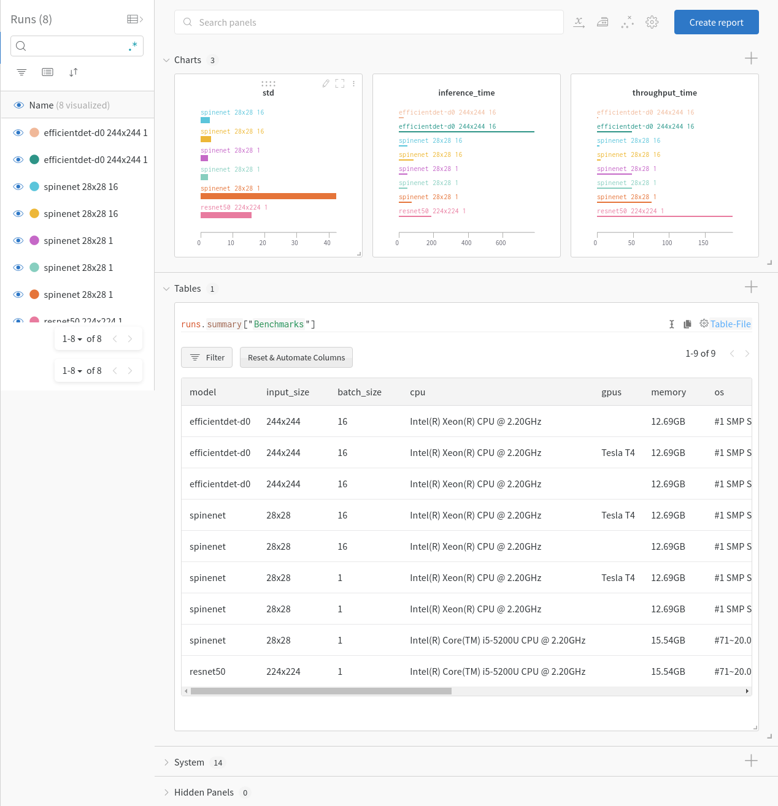

# BenchmarkMyAI: Deep Learning Models Benchmarks

A repository that contains code and benchmarks for commonly used models in RevolveAI.

## Table of Contents

* Directory Tree
* Install
* Quick Start
* List of Available Models
* Run with Weights and Biases
* Add Custom Model
* License


## Directory Tree

```
.
├── LICENSE
├── main.py
├── Makefile
├── rbm
│   ├── backends
│   │   ├── __init__.py
│   │   ├── nlp.py
│   │   ├── tensorflow_backend.py
│   │   ├── torch_backend.py
│   │   └── vision.py
│   ├── __init__.py
│   ├── models
│   │   ├── cv
│   │   │   ├── classification
│   │   │   │   ├── __init__.py
│   │   │   │   └── keras_models.py
│   │   │   ├── __init__.py
│   │   │   ├── object-detection
│   │   │   │   ├── _efficientdet
│   │   │   │   │	└── ...
│   │   │   │   ├── efficientdet.py
│   │   │   │   ├── __init__.py
│   │   │   │   └── spinenet_backbone.py
│   │   │   └── segmentation
│   │   │       ├── inception_unet.py
│   │   │       └── __init__.py
│   │   ├── __init__.py
│   │   └── nlp
│   │       ├── classification
│   │       │   ├── hugging_face.py
│   │       │   └── __init__.py
│   │       ├── hugging_face.py
│   │       ├── __init__.py
│   │       ├── ner
│   │       │   ├── __init__.py
│   │       │   └── nerda.py
│   │       └── qa
│   │           ├── hugging_face.py
│   │           └── __init__.py
│   └── utils
│       ├── benchmark.py
│       ├── info.py
│       ├── __init__.py
│       ├── plugins.py
│       └── wandb.py
├── README.md
├── requirements.txt
├── runall.py
└── tests
    ├── __init__.py
    └── tensorflow-gpu.py
```

## Install

#### **General Usage and Development Install:**

To use the package, first clone the the repository on your local machine and move to the location where it is cloned, then install all the requirements as following:

```bash
python -m pip install -r rquirements.txt
python -m pip install --no-deps tf-models-official
```

It will install all the required packages for this library.

#### **Pip Install**:

To use this repository **only as** library without python files included, clone this repository and run:

```bash
python -m pip install .
```

## Quick Start

Move to the directory where `rbm` folder is located. To calculate benchmarks, run the following code:

```python
# Import the library
import rbm
# Create benchmark instance
benchmarks = rbm.utils.Benchmark(model='ResNet50', batch_size=2, img_size=(224,224), device='CPU:0').execute()
print(benchmarks)
```

Output will be as following:

```python
{'model': 'ResNet50',
 'type': 'CV',
 'task': 'classification',
 'batch_size': 2,
 'input_size': '224x224',
 'cpu': 'Intel(R) Core(TM) i5-5200U CPU @ 2.20GHz',
 'gpus': '',
 'memory': '15.53GB',
 'os': '#27~20.04.1-Ubuntu SMP Tue Jul 13 17:41:23 UTC 2021',
 'python': '3.9.5',
 'framework': 'TensorFlow 2.5.0',
 'gpu_memory_used': '',
 'benchmark': {'inference_time': 257.0438891998492,
  'throughput_time': 128.5219445999246,
  'std': 8.14146124318816}}
```

OR use the terminal as following (not available in pip install):

```bash
python main.py ResNet50 --device="CPU:0" --optional img_size="(224,224)" batch_size="2"
```

To run the benchmarks for all the available models, use the following command:

```bash
python runall.py
```


## List of Available Models

* InceptionUNet
* SpineNetBackbone
* efficientdet-d0 (other possible suffix are d1-d7)
* All models available in Keras applications, [See](https://www.tensorflow.org/api_docs/python/tf/keras/applications#functions_2) list of Keras available models.
* NERDA english models
* HuggingFace text classification and question answering models

To see full list of available models names, run following:

```python
rbm.models.models_names()
```


## Run with Weights and Biases

If you want to add all the benchmarks results in Weights and Biases (aka wandb), first login to wandb using the terminal

```
wandb login
```

Or you can login in interactive environment when you'll run `benchmarker.execute(wandb=True)`

It will ask you to provide *API key*. Go to the [Authorize](https://wandb.ai/authorize) page to get *API key*. 

Note: You should must have wandb account.

After logging in successfully, execute benchmarks `execute` method with `wandb=True` as following:

```python
# Import the library
import rbm
# Create benchmark instance
benchmarks = rbm.utils.Benchmark(model='ResNet50').execute(wandb=True)
```

You should see your each benchmarks results in *wandb* project with project name *benchmarks* (by default). You must see 3 charts *std, inference_time* and *throughput_time* and a table with all benchmarks results. Each time you will run benchmarks, your results will append in *benchmarks* project.

 


## Add Custom Model

To calculate the benchmarks for your own custom model, your model should be in following format:

```python
# This is an example of Image processing model with tensorflow backend


from rbm.utils import plugins
from rbm.backends.vision import ImageProcessing # Type  of model to generate data and calculate information
from rbm.backends import TensorflowBackend # Backend used for model

@plugins.register # Optional if model needs to be add under the direcotry path/to/repo/rbm/models/
class ModelName(TensorflowBackend, ImageProcessing):
    def __init__(self, device='GPU:0', img_size=(224, 224), batch_size=1, **kwargs):
        TensorflowBackend.__init__(self, device=device)
        ImageProcessing.__init__(self, img_size=img_size, batch_size=batch_size)
        ''' 
        Arguments: All these arguments will be acceptable in rbm.utils.Benchmark
	        device: Optional for TensorflowBackend, if device setting acceptable else preferred device will be used
	        img_size: Required, for ImageProcessing class to generate images of given size
	        batch_size: Required, for ImageProcessing class to generate data of given batch size
	        kwargs: Optional
        '''
        self.__name__ = 'model_name' # Name of the model
        self.__type__ = 'CV' # Optional: if model is out of models directory
        self.__task__ = 'classification' # Optional: if model is out of models directory
    def __call__(self):
        # This method should build your model
    def preprocess(self, inputs):
        # This is an optional method, if data need to be preprocessed before predictions and not required to add into inference benchmarking.
        return inputs
    def predict(self, inputs):
        # This method should predict the model output and actual inference will be calculated on this
```

There are two ways to execute your custom model.

1. Pass the `ModelName` class instance as following

   ```python
   benchmarker = rbm.utils.Benchmark(model=ModelName)
   ```

2. First, add your model under the directory `path/to/repo/rbm/models/path/to/model/category/` and assign `@plugins.register` decorator to `ModelName` class which you can import as `from rbm.utils import plugins`. 

   Then pass the model as following:

   ```python
   benchmarker = rbm.utils.Benchmark(model='ModelName')
   ```
   
   **Example:** Here is an example of building custom models:
   
   ```python
   # rbm/models/cv/classification/test_model.py
   
   
   import tensorflow as tf
   import rbm
   from rbm.utils import plugins
   from rbm.backends import TensorflowBackend
   from rbm.backends.vision import ImageProcessing
   
   
   @plugins.register
   class TestModel(TensorflowBackend, ImageProcessing):
       
       def __init__(self, batch_size=1):
           TensorflowBackend.__init__(self)
           ImageProcessing.__init__(self, img_size=(128, 128), batch_size=batch_size)
           self._model = None
           self.__name__ = 'test-model'
           
       def __call__(self):
           inputs = tf.keras.Input((128, 128, 3))
           outputs = tf.keras.layers.Conv2D(6, (1, 1))(inputs)
           model = tf.keras.Model(inputs, outputs)
           self._model = model
           
       def predict(self, inputs):
           self._model.predict(inputs)
           
           
   ```
   
   Now we can execute this model benchmarks as:
   
   ```python
   benchmarker = rbm.utils.Benchmark(model='test-model', batch_size=2) # call by defined name
   benchmarks = benchmarker.execute()
   ```
   
   

# License

[Apache License 2.0](LICENSE)

