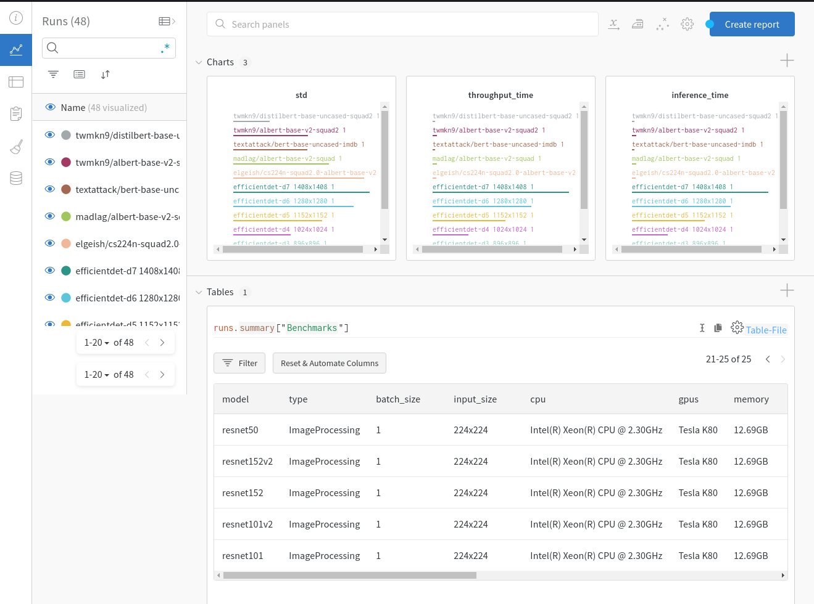

# DeepLearning Models Benchmarks

A repository that contains code and benchmarks for commonly used models in RevolveAI.

## Table of Contents

* Directory Tree
* Install
* Run Benchmarks
* List of Available Models
* Run with Weights and Biases
* Add Custom Model


## Directory Tree

Repository
├── package
│   ├── __init__.py
│   ├── make
│   ├── models
│   │   ├── efficientdet.py
│   │   ├── __init__.py
│   │   ├── kerasModels.py
│   │   ├── saved_models
│   │   └── spineNet.py
│   ├── requirements.txt
│   └── utils
│       ├── benchmark.py
│       ├── __init__.py
│       └── wandb.py
└── README.md


## Install

To use the package, first clone the the repository on your local machine and move to the location where it is cloned, then install all the requirements as following:

```
cd package
make -f make
```

It will install all the required packages for this library.


## Run Benchmarks

Move to the directory where `package` folder is located. To calculate benchmarks, run the following code:

```python
# Import the library
import package as pk
# Create benchmark instance
benchmarker = pk.utils.Benchmark(model='ResNet50', batch_size=2, img_size=(224,224), device='CPU:0')
benchmarks = benchmarker.execute()
```

Output will be as following:

## List of Available Models

* ResNet50
* ResNet101
* MobileNet
* MobileNetV2
* MobileNetV3Small
* MobileNetV3Large
* EfficientNet(B0-B7) e.g. EfficientNetB0
* NASNetMobile
* NASNetLarge
* SpineNet
* efficientdet-(d0-d7) e.g. efficientdet-d0

## Run with Weights and Biases

If you want to add all the benchmarks results in Weights and Biases (aka wandb), first login to wandb using the terminal

```
wandb login
```

It will ask you to provide *api key*. Go to the [Authorize](https://wandb.ai/authorize) page to get *api key*. 
Note: You should must have wandb account.

After logging in successfully, execute benchmarks `execute` method with `wandb=True` as following:

```python
# Import the library
import package as pk
# Create benchmark instance
benchmarker = pk.utils.Benchmark(model='ResNet50', batch_size=2, img_size=(224,224), device='CPU:0')
benchmarks = benchmarker.execute(wandb=True)
```

You should see your each benchmarks results in *wandb* project with project name *benchmarks*. You must see 3 charts *std, inference_time* and *throughput_time* and a table with all benchmarks results. Each time you will run benchmarks, your results will append in *benchmarks* project.

 


## Add Custom Model

To calculate the benchmarks for your own custom model, your model should be in following format:

```python
class ModelName:
    def __init__(self, *args, **kwargs):
        self.__framework__ = 'Framework 2.3.0' # Framework used for model
        self.__name___ = 'model_name' # Name of model
    def predict(self, inputs, *args, **kwargs):
        # This method should predict the model output
```

There are two ways to execute your custom model.

1. Pass the `ModelName` class instance as following

   ```python
   benchmarker = pk.utils.Benchmark(model=ModelName, batch_size=2, img_size=(224,224), device='CPU:0')
   ```

2. First, add your model in `package/models` directory e.g. add `ModelName` class in the file `ModelName.py`

   Then edit `package/models/__init__.py` file and add new line at the end for your model as `from .ModelName import ModelName`

   Then pass the model as following:

   ```python
   benchmarker = pk.utils.Benchmark(model='ModelName', batch_size=2, img_size=(224,224), device='CPU:0')
   ```

   